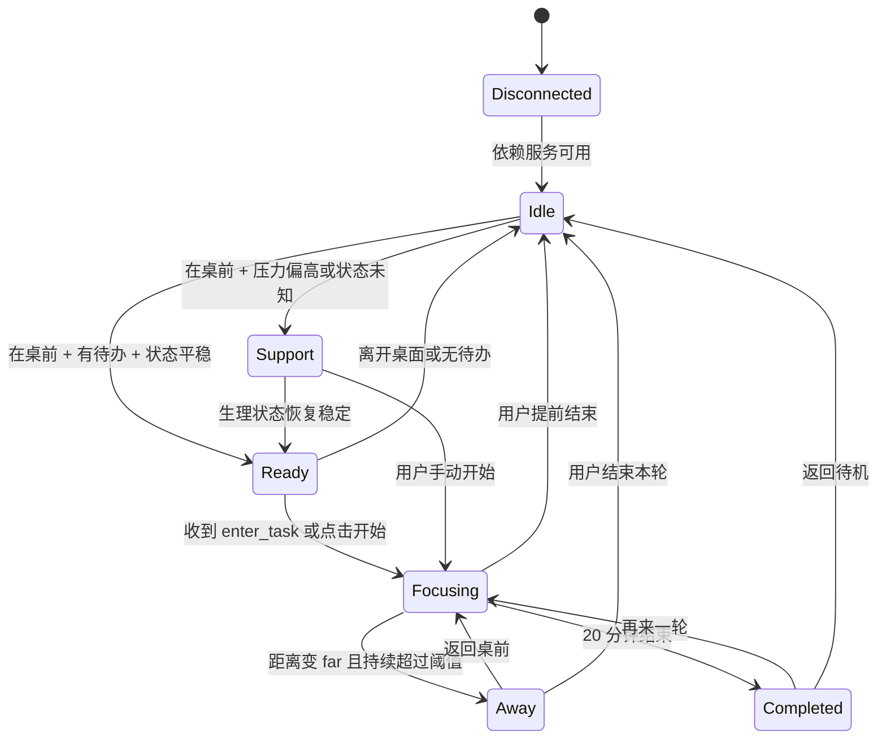

# Rovia Desktop MVP 需求文档

## 1. 文档信息

- 产品名称：Rovia Desktop
- 文档类型：MVP 需求说明
- 版本：v0.2
- 更新日期：2026-04-04
- 文档目标：定义一个可落地的桌宠式桌面助手 MVP，通过桌面宠物这一情感化媒介，联动手环传感器、蓝牙距离感知、Supabase 云端数据库与 TodoList，构建一个低压力的专注支持环境。

## 2. 产品定义

Rovia Desktop 是一个常驻电脑桌面的状态化任务助手。它不是传统意义上的番茄钟或待办软件，而是一个带有情绪表达的桌面宠物：

- 它感知用户是否在桌前
- 它接收手环提供的生理状态信号，如 HRV / 压力分级
- 它读取并同步用户当前 TodoList
- 它通过柔和的视觉反馈、低打扰提醒与任务面板，帮助用户更轻松地进入并完成一轮专注

MVP 核心闭环为：

`手环/蓝牙信号 + Todo 数据 -> 桌宠判断当前支持策略 -> 用户进入 20 分钟专注 -> 会话结果同步 Supabase`

## 3. MVP 要验证的核心命题

- 情感化桌宠是否比传统倒计时工具更容易降低用户的启动阻力。
- 生理状态、物理距离与任务状态三类信号联动后，是否能提供更合适、更温和的专注支持。
- Supabase 作为云端数据中心，是否足以承载 Todo、会话记录与实时状态同步。

## 4. MVP 目标

### 4.1 业务目标

- 验证“桌宠 + 传感器 + 任务数据”的交互组合是否成立。
- 验证用户是否愿意把桌宠作为专注过程中的主要陪伴入口。
- 验证数据联动链路在日常场景中是否稳定可用。

### 4.2 用户目标

- 不必打开复杂应用，也能知道自己现在适不适合开始专注。
- 在桌前时，桌宠能给出温和、清晰、不压迫的状态反馈。
- 专注时能看到当前任务、剩余时间与自身状态变化。
- 离开桌面、压力偏高或任务完成时，系统能给出符合情境的反馈，而不是机械计时。

## 5. 核心设计原则

- 低压力优先：系统不能用高频催促、红色警报或惩罚逻辑逼迫用户专注。
- 情境感知优先：优先根据用户是否在桌前、是否有任务、当前生理状态来决定提示方式。
- 本地实时优先：桌宠状态判断应先在本地完成，再同步到云端；不能依赖网络往返才能做出界面反馈。
- 云端可追踪：Todo、会话和关键事件需要同步到 Supabase，便于后续统计和跨端扩展。
- MVP 边界清晰：只做支持专注的最短闭环，不做健康诊断和复杂生产力系统。

## 6. MVP 非目标

以下内容不纳入本期 MVP：

- 医疗级 HRV 分析、压力诊断或任何健康建议
- 完整的任务管理平台、项目管理系统、日历系统
- 多设备复杂同步冲突处理
- 智能推荐算法、AI 对话助手、自动任务拆分
- 精确到米级的室内定位
- 多人协作和团队功能

## 7. 目标用户

- 有智能手环或蓝牙穿戴设备的知识工作者
- 经常长时间使用电脑，但进入任务时存在心理阻力的用户
- 希望获得“陪伴式提醒”，而不是“管理式施压”的用户

## 8. MVP 范围边界

### 8.1 本期必须实现

- 桌宠常驻桌面与任务面板
- 手环数据接入：至少支持 HRV 或压力等级中的一种有效状态输入
- 蓝牙距离感知：至少输出 `near` / `far` 两档状态
- Supabase 数据同步：TodoList、FocusSession、关键事件日志
- 20 分钟固定专注周期
- 基于生理状态、距离状态、任务状态的联动反馈

### 8.2 本期尽量收紧

- 只支持一个账号
- 只支持一个主设备来源
- 只支持一个当前活跃任务
- 只支持单桌面端优先实现，建议先从 macOS 开始

## 9. 系统组成与职责

### 9.1 Desktop App

- 渲染桌宠与任务面板
- 本地维护实时状态机
- 接收桥接服务输入
- 控制提醒、动画与会话计时
- 作为 Supabase 的读写客户端

### 9.2 Wearable Bridge

- 负责把手环或硬件设备数据转换为统一事件流
- 输出标准化的生理状态与设备动作
- 不在桌宠端直接处理厂商协议细节

### 9.3 Bluetooth Proximity Service

- 基于 RSSI 或等价信号，输出用户与电脑之间的近远状态
- 提供去抖与状态稳定化逻辑，避免距离频繁跳变

### 9.4 Supabase

- 持久化 TodoList、FocusSession、传感器快照与关键事件
- 提供实时订阅能力给桌面端
- 为后续历史记录与跨端扩展提供统一数据源

## 10. 关键使用场景

### 场景 A：用户在桌前且状态平稳

用户靠近电脑，手环最新状态显示压力不高，TodoList 中存在待办任务。桌宠进入“可开始”形态，提示用户可以开始一轮专注。

### 场景 B：用户压力偏高但仍在桌前

手环数据表明当前压力偏高或 HRV 状态不理想。桌宠不强推开始专注，只展示更柔和的支持态，并允许用户手动开始任务。

### 场景 C：用户已经开始专注但暂时离开桌面

桌宠通过蓝牙距离感知到用户已离开桌前，提醒逻辑自动变轻，状态切换为“等待返回”，并记录一次离开事件。

### 场景 D：Todo 在其他端被修改

用户在手机或 Web 端修改了 TodoList，Supabase Realtime 将更新同步到桌面端，Rovia 任务面板实时刷新当前任务状态。

## 11. 联动闭环

1. 手环桥接服务定期上报 HRV / 压力等级，并同步到桌面端。
2. 蓝牙距离服务持续输出用户是否在桌前。
3. 桌面端从 Supabase 拉取并订阅 TodoList。
4. 本地状态机综合三类信号，决定桌宠当前形态：
   - 待机
   - 可开始
   - 支持/安抚
   - 专注中
   - 离开中
   - 完成
5. 用户通过手环动作或桌面按钮启动一轮 20 分钟专注。
6. 桌面端在本地执行计时与交互反馈，并把会话写入 Supabase。
7. 会话结束或中断后，桌宠展示结果，任务状态与会话状态同步回云端。

## 12. 状态模型

### 12.1 运行状态

- `Disconnected`：桥接服务、蓝牙感知或 Supabase 关键依赖不可用
- `Idle`：系统可用，但当前无明显任务引导
- `Ready`：用户在桌前、存在待办任务、且状态允许开始专注
- `Support`：用户在桌前，但压力偏高或生理状态未知，系统保持柔和支持，不主动施压
- `Focusing`：正在进行 20 分钟专注
- `Away`：专注过程中用户暂时离开桌面
- `Completed`：专注结束，等待用户确认

### 12.2 桌宠情绪映射

- `Idle` -> Calm
- `Ready` -> Invite
- `Support` -> Care
- `Focusing` -> Focus
- `Away` -> Wait
- `Completed` -> Celebrate

### 12.3 状态转移



## 13. 核心联动规则

### 13.1 生理状态规则

- MVP 不直接解释原始健康数据，只接收标准化状态：
  - `ready`
  - `strained`
  - `unknown`
- 当最近一条生理状态超过 120 秒未更新时，自动视为 `unknown`。
- 当状态为 `strained` 时，桌宠进入 `Support`，压低主动提醒频率，不使用鼓励冲刺型文案。

### 13.2 距离感知规则

- MVP 只要求输出两档：
  - `near`
  - `far`
- 距离状态应经过去抖，避免 RSSI 波动造成频繁跳变。
- 若用户在 `Focusing` 中连续超过设定阈值处于 `far`，系统进入 `Away`。

### 13.3 Todo 联动规则

- TodoList 数据以 Supabase 为主数据源。
- 桌面端默认展示：
  - 当前活跃任务
  - 其余 3 到 5 个待办任务
- 若未选中当前任务，开始专注时默认绑定第一条待办；若待办为空，则创建占位任务“本次专注”。

### 13.4 会话联动规则

- 当 `Ready` 状态下收到 `enter_task` 事件时，应直接开始一轮 20 分钟专注。
- 当 `Support` 状态下收到 `enter_task` 事件时，允许开始专注，但提醒文案应更柔和，例如“先慢慢开始这一轮”。
- 若当前已经在 `Focusing`，重复收到 `enter_task` 事件时不应新建会话，只做轻提示。

## 14. 功能需求

### 14.1 FR-01 桌宠常驻与情感表达

- 桌宠以无边框、透明背景小窗常驻桌面。
- 支持拖拽、边缘吸附、位置记忆。
- 默认不抢占输入焦点。
- 不同状态下桌宠必须有可感知差异，至少体现在以下两项：
  - 颜色/光效
  - 表情/姿态
  - 环形进度或状态徽标
- 点击桌宠可展开或收起任务面板。

### 14.2 FR-02 手环生理状态接入

- 系统需从桥接服务接收以下标准化字段中的最小集合：
  - `deviceId`
  - `timestamp`
  - `hrv` 或 `stressScore`
  - `physioState`
- MVP 优先使用桥接层产出的 `physioState`，避免桌宠端直接承担复杂算法解释。
- 生理状态更新到界面的延迟应小于 5 秒。
- 若生理数据缺失，不应阻止手动开始专注，只应显示“状态未知”。

### 14.3 FR-03 蓝牙距离感知

- 系统需接收蓝牙距离服务输出的 `near` / `far` 状态。
- 距离刷新间隔建议不高于 10 秒。
- 状态切换应有去抖机制，例如需要连续多次采样一致后才更新。
- 距离变化需影响桌宠状态与提醒策略。

### 14.4 FR-04 TodoList 管理

- 系统需从 Supabase 读取并订阅 TodoList 的实时变化。
- 任务面板至少展示：
  - 当前活跃任务
  - 其余待办列表
  - 当前任务状态
  - 当前会话剩余时间
- 任务面板至少支持：
  - 选择当前任务
  - 编辑当前任务标题
  - 标记任务完成
  - 快速创建一条新任务

### 14.5 FR-05 20 分钟专注会话

- 专注时长固定为 20 分钟。
- 启动方式至少支持两种：
  - 手环/硬件动作 `enter_task`
  - 桌面端点击开始
- 一个时刻只允许一个活跃专注会话。
- 会话启动后应立即在桌宠上显示倒计时与专注形态。

### 14.6 FR-06 低压力支持策略

- 当状态为 `Ready` 时，桌宠可展示开始引导，但不应使用强迫式文案。
- 当状态为 `Support` 时，桌宠应弱化任务推进感，强调陪伴和稳定。
- 当状态为 `Away` 时，系统应暂停主动提醒，只保留状态展示与事件记录。
- 在任何状态下，用户都可以手动开始、结束或重开一轮专注。

### 14.7 FR-07 轻量提醒

- `Focusing` 中最多提供 3 类提醒：
  - 刚开始
  - 剩余 10 分钟
  - 剩余 1 分钟
- 提醒应以轻视觉反馈为主，可选弱提示音。
- 若当前 `physioState = strained`，提醒强度应自动降低。

### 14.8 FR-08 Supabase 数据同步

- 系统需将以下数据写入 Supabase：
  - Todo 数据
  - FocusSession 数据
  - 生理状态快照
  - 距离状态事件
- 桌面端应订阅 Todo 与 FocusSession 的实时更新。
- 网络不可用时，桌面端需保留本地运行能力，并在恢复后重试同步。

### 14.9 FR-09 会话记录与恢复

- FocusSession 至少记录：
  - 任务 ID / 标题
  - 开始时间
  - 结束时间
  - 会话状态
  - 触发来源
  - 开始时的生理状态
  - 会话中的离开次数
- 若应用异常退出且存在未结束会话，重启后应尝试恢复。

### 14.10 FR-10 异常与回退处理

- 任一信号源不可用时，系统不能整体失效，应退回更保守的支持模式。
- Supabase 不可达时，Todo 面板应明确显示同步异常，但当前会话可继续。
- 蓝牙距离异常时，系统可退化为不感知离开状态。
- 生理状态异常时，系统可退化为普通桌宠 + Todo + Timer 模式。

## 15. 界面与交互要求

### 15.1 桌宠本体

- 体量小，适合停留在屏幕边缘。
- 视觉风格应更像陪伴角色，而不是工具图标。
- 在 `Ready`、`Support`、`Focusing`、`Completed` 四种关键状态下差异必须足够明显。

### 15.2 任务面板

- 轻量浮层展开，不打断当前工作窗口。
- 信息优先级从上到下为：
  - 当前任务
  - 剩余时间
  - 当前状态标签
  - 生理状态标签
  - 距离状态标签
  - TodoList
- 生理状态文案必须用支持型表达，例如“状态平稳”“略紧张”“状态未知”，避免医疗化术语直接暴露给用户。

### 15.3 动效与文案

- 动效短而克制，避免高频晃动。
- 文案应传达陪伴感，避免“你应该”“马上开始”这类命令式语气。

## 16. 数据模型建议

### 16.1 FocusSession

```json
{
  "id": "uuid",
  "userId": "uuid",
  "todoId": "uuid",
  "taskTitle": "整理需求文档",
  "status": "focusing | completed | interrupted",
  "startedAt": "ISO8601",
  "endedAt": "ISO8601",
  "durationSec": 1200,
  "triggerSource": "wearable | desktop",
  "startPhysioState": "ready | strained | unknown",
  "awayCount": 1
}
```

### 16.2 WearableSnapshot

```json
{
  "id": "uuid",
  "userId": "uuid",
  "deviceId": "band_01",
  "hrv": 42,
  "stressScore": 61,
  "physioState": "ready | strained | unknown",
  "recordedAt": "ISO8601"
}
```

### 16.3 PresenceEvent

```json
{
  "id": "uuid",
  "userId": "uuid",
  "deviceId": "band_01",
  "presenceState": "near | far",
  "rssi": -68,
  "recordedAt": "ISO8601"
}
```

### 16.4 Todo

```json
{
  "id": "uuid",
  "userId": "uuid",
  "title": "整理需求文档",
  "status": "pending | doing | done",
  "isActive": true,
  "updatedAt": "ISO8601"
}
```

## 17. Supabase 表建议

- `todos`
- `focus_sessions`
- `wearable_snapshots`
- `presence_events`
- `app_events`

建议说明：

- `todos` 和 `focus_sessions` 开启 Realtime 订阅
- `wearable_snapshots` 和 `presence_events` 以追加写入为主
- `app_events` 用于记录关键交互，如开始、完成、离开、恢复

## 18. 非功能需求

- 桌宠状态切换的本地反馈延迟应尽量小于 1 秒。
- Todo 从 Supabase 更新到桌面端的可感知延迟应尽量小于 2 秒。
- 桌面应用需要轻量常驻，避免明显 CPU 占用波动。
- 应支持本地缓存，保证短时断网下专注流程不中断。
- 所有健康相关展示必须明确为“状态支持”，而非医学结论。

## 19. MVP 验收标准

以下标准全部满足，可视为 MVP 可演示：

- 桌宠可在桌面常驻，并显示至少 4 种明确状态变化。
- 系统能接收手环桥接输入，并基于 `physioState` 更新桌宠状态。
- 系统能接收蓝牙距离状态，并在用户离开桌面时切换到 `Away` 或等价状态。
- 桌面端能从 Supabase 拉取并实时刷新 TodoList。
- 用户可选择任务并发起一轮 20 分钟专注。
- 专注会话能同步写入 Supabase，并记录开始、结束和中断状态。
- 生理状态偏高时，系统提示策略会变柔和，而不是完全一致地推动用户开始。
- 网络短时异常或单个信号源异常时，应用仍可继续基本专注流程。

## 20. 建议的 P0 / P1 拆分

### P0

- 桌宠常驻
- 任务面板
- TodoList 与 Supabase 同步
- `physioState` 输入
- `near` / `far` 距离状态
- 20 分钟专注会话
- 会话日志
- 本地状态机与异常回退

### P1

- 更丰富的桌宠动画
- 更多距离档位
- 历史统计页
- 更细的提醒策略
- 多端任务编辑

## 21. 关键假设与风险

### 关键假设

- 用户愿意让桌宠基于自身状态调整提醒方式。
- 手环侧能够稳定输出简化后的生理状态，而不是只提供难以解释的原始数据。
- Supabase Realtime 的性能足以支撑桌面 Todo 联动。

### 关键风险

- BLE 距离波动可能导致状态误判，需要去抖策略。
- 不同手环厂商的 HRV / 压力口径差异较大，必须统一为简化状态。
- 如果桌宠反馈过多，可能从陪伴工具变成新的干扰源。
- 如果 Supabase 成为运行时强依赖，会损害实时体验，因此需要本地优先策略。

## 22. 一句话总结

Rovia Desktop MVP 的重点不只是“桌面上有一个宠物”，而是让这个桌宠成为手环生理信号、蓝牙空间感知、Supabase 云端任务数据之间的柔性中介，把原本分散的数据转化为一套低压力、可执行、可同步的专注支持体验。
