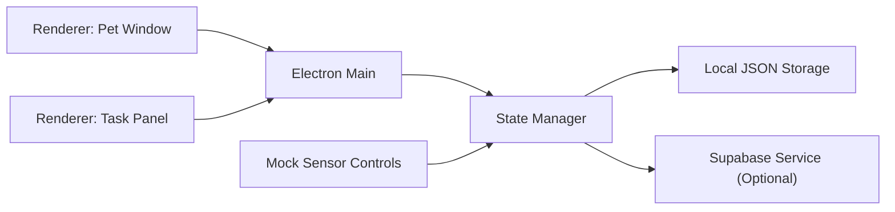

# Rovia Desktop 技术方案

## 1. 目标

基于 [roviagemini.md](/Users/zhangjiayi/.codex/webped/docs/roviagemini.md) 的 PRD，先落一版可运行的桌宠桌面原型，并把后续接入手环 BLE、Supabase Realtime 和移动端协同的技术路径拆清楚。

本方案分两层：

- 原型层：先完成电脑端桌宠、任务面板、状态机、模拟传感器、可选 Supabase 同步
- 生产层：再补 Python BLE 网关、手机端、真实 BLE 设备协议适配、RLS 和稳定性治理

## 2. 技术选型

### 2.1 桌面端

- 框架：Electron
- UI：原生 HTML / CSS / JavaScript
- 原因：
  - 快速做透明、无边框、常驻桌面的桌宠窗口
  - 容易同时管理主窗口、任务面板、IPC 和本地持久化
  - 后续可以平滑接入 Node 侧 BLE 服务、Python sidecar、Supabase SDK

### 2.2 数据同步

- 云端：Supabase
- 同步方式：
  - Todo 使用 `select + realtime subscription`
  - FocusSession / Telemetry / AppEvent 使用 `insert / upsert`

### 2.3 BLE 接入

推荐生产方案：

- Python sidecar 负责 BLE 扫描、手环协议适配、RSSI 距离估计
- Electron 主进程通过本地 `WebSocket / HTTP / stdin` 接收标准化事件

原因：

- BLE 设备适配复杂，Python 的生态和调试链路更成熟
- 可以把 UI 和设备协议解耦，避免桌面前端直接吞硬件细节

## 3. 当前原型架构



### 3.1 模块职责

- `src/main/main.js`
  - 创建桌宠窗口和任务面板窗口
  - 负责窗口定位、显示隐藏、IPC 注册
- `src/main/state-manager.js`
  - 管理核心状态机
  - 管理专注会话、Todo、提醒逻辑
  - 汇总生理状态和距离状态
- `src/main/supabase-service.js`
  - 管理 Supabase 读写和 Realtime 订阅
- `src/main/storage.js`
  - 本地 JSON 持久化
- `src/renderer/pet.*`
  - 桌宠视觉和快速操作
- `src/renderer/panel.*`
  - 任务面板、传感器模拟、会话操作

## 4. 状态机设计

### 4.1 运行状态

- `Idle`
- `Ready`
- `Support`
- `Focusing`
- `Away`
- `Completed`
- `Disconnected`

### 4.2 判断逻辑

- `Ready`
  - `presenceState = near`
  - `physioState = ready`
  - 存在未完成 Todo
- `Support`
  - `presenceState = near`
  - `physioState = strained | unknown`
- `Focusing`
  - 当前存在活跃 FocusSession
- `Away`
  - 活跃 FocusSession 期间，`presenceState = far` 且持续 5 秒
- `Completed`
  - FocusSession 倒计时结束

### 4.3 当前原型内的状态来源

- `physioState`
  - 原型中由面板按钮模拟
  - 生产中由 BLE 网关写入
- `presenceState`
  - 原型中由面板按钮模拟
  - 生产中由 RSSI 计算并输出
- `Todo`
  - 原型中本地可新增、编辑，也可选配 Supabase
  - 生产中以 Supabase 为主数据源

## 5. 数据流

### 5.1 专注启动流

1. 用户点击面板按钮，或模拟手环触发 `enter_task`
2. 主进程调用 `stateManager.startFocus`
3. 选中当前 Todo 或创建占位任务
4. 写入本地状态
5. 若 Supabase 已配置，则同步 `focus_sessions`
6. Pet Window 和 Panel Window 实时刷新

### 5.2 生理状态更新流

1. 传感器桥接服务输出 `physioState`
2. 主进程调用 `stateManager.setPhysioState`
3. 更新桌宠情绪和提醒强度
4. 若已配置 Supabase，则写入 `telemetry_data`

### 5.3 离位感知流

1. BLE 网关或模拟面板输出 `presenceState = far`
2. 状态机开始 5 秒去抖计时
3. 若仍为 `far`，专注状态切到 `Away`
4. 写入 `app_events`

## 6. 数据库设计建议

基于 PRD，建议使用以下表：

### 6.1 `telemetry_data`

- `id uuid primary key`
- `user_id uuid`
- `hrv float8`
- `stress_level int4`
- `physio_state text`
- `is_at_desk boolean`
- `recorded_at timestamptz`

### 6.2 `todos`

- `id uuid primary key`
- `user_id uuid`
- `title text`
- `task_text text`
- `status text`
- `is_completed boolean`
- `is_active boolean`
- `priority int4`
- `updated_at timestamptz`

### 6.3 `focus_sessions`

- `id uuid primary key`
- `user_id uuid`
- `todo_id uuid`
- `task_title text`
- `start_time timestamptz`
- `end_time timestamptz`
- `duration int4`
- `duration_sec int4`
- `status text`
- `trigger_source text`
- `start_physio_state text`
- `away_count int4`
- `updated_at timestamptz`

### 6.4 `app_events`

- `id bigint generated by default as identity primary key`
- `user_id uuid`
- `event_type text`
- `payload jsonb`
- `created_at timestamptz`

## 7. Supabase 安全策略

P0 建议：

- 所有业务表启用 RLS
- 所有查询都按 `auth.uid() = user_id` 过滤
- 桌面原型可先使用匿名 key + 单人 demo user

生产阶段：

- 手机端和桌面端都走 Supabase Auth
- 不再使用固定 `ROVIA_USER_ID`

## 8. 真实 BLE 网关建议

### 8.1 Sidecar 输出协议

建议 Python sidecar 向 Electron 发统一 JSON：

```json
{
  "type": "telemetry",
  "deviceId": "band_01",
  "hrv": 42,
  "stressScore": 81,
  "physioState": "strained",
  "presenceState": "near",
  "timestamp": "2026-04-04T10:00:00Z"
}
```

以及：

```json
{
  "type": "enter_task",
  "deviceId": "band_01",
  "timestamp": "2026-04-04T10:00:00Z"
}
```

### 8.2 侧车职责

- BLE 扫描与断线重连
- RSSI 去抖与距离估算
- 手环按键事件识别
- HRV / 压力原始值转标准化 `physioState`

### 8.3 Electron 侧职责

- 不处理厂商级 BLE 协议
- 只消费标准化状态和动作事件

## 9. 原型已实现范围

- Electron 桌宠窗口
- Electron 任务面板
- 20 分钟专注会话
- Todo 增加、改名、设为当前、标记完成
- `ready / strained / unknown`
- `near / far`
- `Ready / Support / Focusing / Away / Completed`
- 本地 JSON 存储
- 可选 Supabase 同步入口

## 10. 下一步开发顺序

### P0

- 接入真实 Supabase schema
- 增加 SQL migration
- 为 Todo / FocusSession / Event 增加更稳定的同步重试
- 接入 Python BLE sidecar 的本地 IPC

### P1

- 手机端最小版 Todo / FocusSession 视图
- Realtime 推送联动
- 手环震动反馈回写
- 更完整的桌宠动画与音效策略

### P2

- 历史统计
- 自适应提醒策略
- 多设备支持
- 自动任务推荐

## 11. 为什么先做这个原型

这版原型的价值不在于“已经把全链路做完”，而在于先把最关键的桌面体验和状态机打通：

- 桌宠是不是足够自然
- Todo 与桌宠之间的关系是否顺手
- 生理状态和离位状态会不会让交互更好，而不是更吵
- Electron 主进程作为状态中枢是否足够稳定

如果这版体验成立，后面接真实 BLE 和手机端时，基本不需要推翻当前桌面架构，只需要把模拟输入替换成真实 sidecar 事件流。
